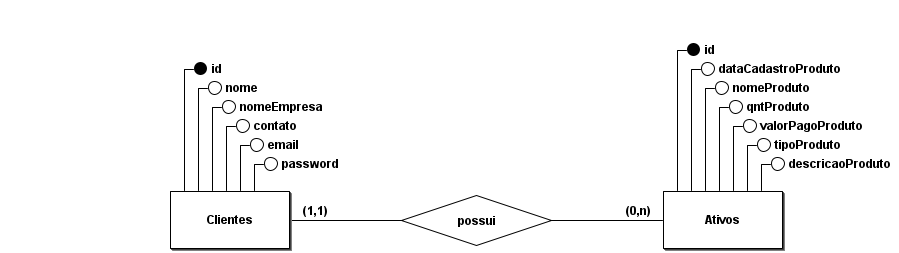
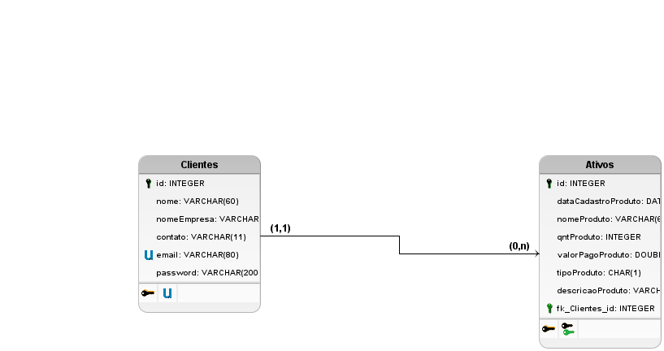

# API MoreU

API feita para estudos do projeto da faculdade com o intuito de realizar o controle de ativos de uma empresa (Cliente)

## Objetivos do Case:

- Gerar relatório de um controle de ativos
- Monitoramento em tempo real dos ativos da empresa
- Obter e adicionar informações de ativos da empresa 

## Funcionalidades do Case:

- Usuário deve gerar registro de ativos da empresa
- Usuário poderá utilizar todas as operações CRUD no sistema
- Usuário poderá filtrar informações e gerar relatórios a partir delas

## Funcionalidades não implementadas

- Sistema de login e autenticação

## Macro funcionalidades

- Sistema CRUD completo e semântico 
- Restful API utilizando ORM 

## Stack

     


## Instalação

Para realizar a instalação, primeiro, clone o repositório em sua máquina:

### Clonando o repositório

```
git clone https://github.com/AntonioALino/API_MoreU.git
```

Acesse a pasta:

```
cd API_MoreU
```

### Configurando o ambiente

Agora, iremos criar um ambiente de desenvolvimento python com o seguinte comando:

```
python -m venv .venv
```

Então vamos acessar esse ambiente que acabamos de criar:

```
source .venv/bin/activate
```

Vamos também instalar todas as dependências:

```
pip install -r requirements.txt
```

Também importe o arquivo ```dump.sql``` em seu servidor MySQL.


Por fim, você precisará criar/editar o arquivo ```.env``` presente na raiz do projeto, adicionando suas credenciais de conexão com o banco de dados:

```env
URL=mysql+mysqlconnector://usuário do banco:senha do banco@servidor do banco/moreu
```

Pronto! O projeto está pronto para ser testado!


## Testando

Execute o código em seu editor favorito, ou rode o seguinte comando no terminal:

```
flask --app main.py
```

Você também pode testar online, com uma interface gráfica acessando o seguinte link:

https://moreu-frontend.vercel.app


## Modelo Relacional e lógico


Modelo Relacional:




Modelo Lógico:




## Endpoints

### /ativos

#### PUT
##### Descrição:

Rota utilizada para edição de ativos,
                                 nela é necessário informar os dados referentes ao ativo a ser editado

##### Parâmetros

| Nome    | Localizado em | Descrição         | Requirido | Esquema        |
| ------- | ---------- | ------------------- | -------- | ---------------- |
| payload | body       | Corpo da requisição | Sim      | Ativos

##### Respostas

| Código | Descrição | Schema |
| ---- | ----------- | ------ |
| 200 | Alterado com sucesso! |
| 204 | Sem conteúdo |
| 500 | Erro no servidor | Server Error |

#### POST
##### Descrição:

Rota utilizada para cadastro de ativos,
                               nela é necessário informar os dados referentes ao ativo a ser cadastro

##### Parâmetros

| Nome | Localizado em | Descrição | Requerido | Esquema |
| ---- | ---------- | ----------- | -------- | ---- |
| payload | body | Corpo da requisição | Yes | Cadastro de ativos |

##### Respostas

| Código | Descrição | Esquema |
| ---- | ----------- | ------ |
| 201 | Criado com sucesso! |
| 500 | Erro no servidor | Server Error |

#### GET
##### Descrição:

Rota utilizada para busca de ativos,
                               ela retorna todos os ativos referentes a determinado cadastro

##### Respostas

| Código | Descrição | Esquema |
| ---- | ----------- | ------ |
| 200 | Buscado com sucesso! | Ativos |
| 500 | Erro no servidor | Server Error |

### /ativos/{id}

#### DELETE
##### Descrição:

Rota utilizada para remoção de ativos,
                                   é necessário inserir o id referente ao ativo a ser removido

##### Parâmetros

| Nome | Localizado em | Descrição | Requerido | Tipo |
| ---- | ---------- | ----------- | -------- | ---- |
| id | path | Id referente ao ativo a ser deletado | Sim | string |

##### Respostas

| Código | Descrição | Esquema |
| ---- | ----------- | ------ |
| 200 | deletado com sucesso! |
| 204 | Sem conteúdo |
| 500 | Erro no servidor | Server Error |

#### GET
##### Descrição:

Rota utilizada para busca de um único ativo tendo como base seu ID,
                               é necessário inserir o ID referente ao ativo a ser buscado

##### Parâmetros

| Nome | Localizado em | Descrição | Requirido | Tipo |
| ---- | ---------- | ----------- | -------- | ---- |
| id | path | Id referente ao ativo a ser buscado | Sim | string |

##### Respostas

| Código | Descrição | Esquema |
| ---- | ----------- | ------ |
| 200 | Buscado com sucesso! | Ativos |
| 204 | Sem conteúdo |
| 500 | Erro no servidor | Server Error |

### /clientes/

#### PUT
##### Descrição:

Rota utilizada para edição de clientes,
                                 nela é necessário informar os dados referentes ao cliente a ser editado

##### Parâmetros

| Nome | Localizado em | Descrição | Requirido | Esquema |
| ---- | ---------- | ----------- | -------- | ---- |
| payload | body | Novos dados do cliente a ser atualizado | Sim | Clientes |

##### Respostas

| Código | Descrição | Esquema |
| ---- | ----------- | ------ |
| 200 | Alterado com sucesso! |
| 204 | Sem conteúdo |
| 409 | Conflito. Email já cadastrado |
| 500 | Erro no servidor | ServerError |

#### POST
##### Descrição:

Rota utilizada para cadastro de clientes,
                                 nela é necessário informar os dados referentes ao cliente a ser cadastro

##### Parâmetros

| Nome | Localizado em | Descrição | Requirido | Esquema |
| ---- | ---------- | ----------- | -------- | ---- |
| payload | body | Dados necessários para cadastro de clientes | Sim | Cadastro de clientes |

##### Responses

| Código | Descrição | Esquema |
| ---- | ----------- | ------ |
| 201 | Criado com sucesso! |
| 500 | Erro no servidor | Server Error |

#### GET
##### Descrição:

Rota utilizada para busca de clientes,
                               ela retorna todos os clientes referentes a determinado cadastro

##### Respostas

| Código | Descrição | Esquema |
| ---- | ----------- | ------ |
| 200 | Buscado com sucesso! | Buscar clientes |
| 500 | Erro no servidor | Server Error |

### /clientes/{id}

#### DELETE
##### Descrição:

Rota utilizada para remoção de clientes,
                                   é necessário inserir o id referente ao cliente a ser removido

##### Parâmetros

| Nome | Localizado em | Descrição | Requirido | Esquema |
| ---- | ---------- | ----------- | -------- | ---- |
| id | path | Id referente ao cliente a ser deletado | Sim | string |

##### Respostas

| Code | Description | Schema |
| ---- | ----------- | ------ |
| 200 | deletado com sucesso! |  |
| 204 | Sem conteúdo |  |
| 500 | Erro no servidor | Server Error |


### Esquemas

#### Ativos

| Nome | Tipo | Descrição | Requirido |
| ---- | ---- | ----------- | -------- |
| Ativos |


#### Cadastro de ativos

| Nome | Tipo | Descrição | Requirido |
| ---- | ---- | ----------- | -------- |
| dataCadastroProduto | date | Data de cadastro do produto | Sim |
| nomeProduto | string | Nome do produto | Sim |
| qntProduto | integer | Quantidade do produto | Sim |
| valorPagoProduto | number | Valor pago pelo produto | Sim |
| tipoProduto | string | Classificação do produto. Valores: (P)eriféricos | (D)ecorações | (M)óveis | (E)letrônicos | Sim |
| descricaoProduto | string | Descrição do produto | Sim |

#### Server Error

| Nome | Tipo | Descrição | Requirido |
| ---- | ---- | ----------- | -------- |
| error | string | Erro referido | Não |

#### Clientes

| Nome | Tipo | Descrição | Requirido |
| ---- | ---- | ----------- | -------- |
| cliente com todos os campos |

#### Cadastro de clientes

| Nome | Tipo | Descrição | Requirido |
| ---- | ---- | ----------- | -------- |
| Cadastro de clientes |

#### Busca de clientes

| Nome | Tipo | Descrição | Requirido |
| ---- | ---- | ----------- | -------- |
| nome | string | Nome do cliente | Sim |
| email | string | Email do cliente | Sim |
| contato | integer | Número de telefone do cliente | Sim |
| nomeEmpresa | string | Nome da empresa a qual o cliente é sócio/colaborador | Sim |

#### Buscar clientes

| Nome | Tipo | Descrição | Requirido |
| ---- | ---- | ----------- | -------- |
| Buscar clientes |
